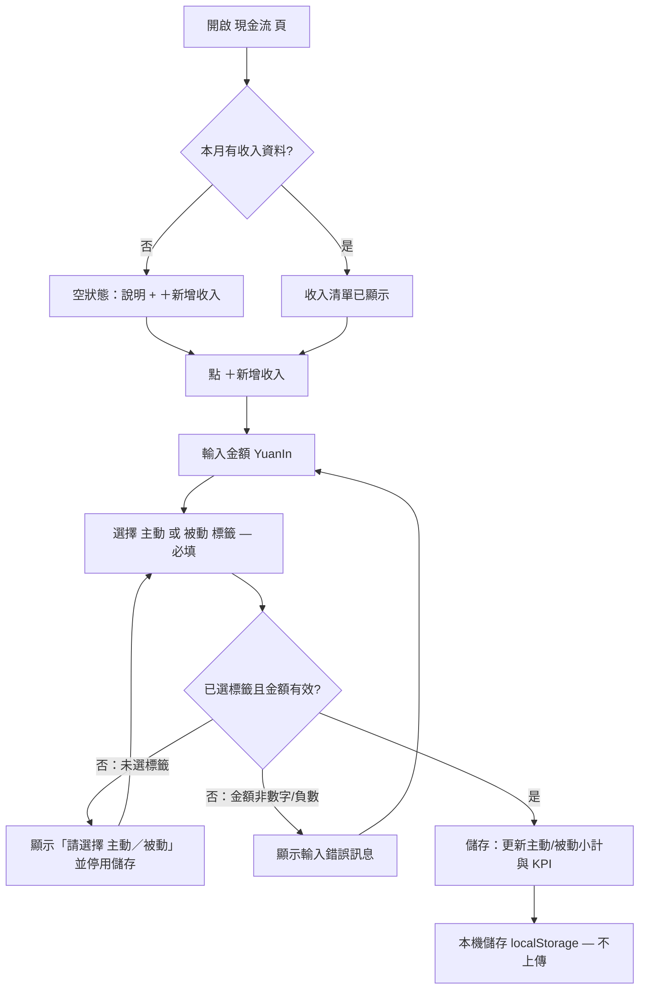
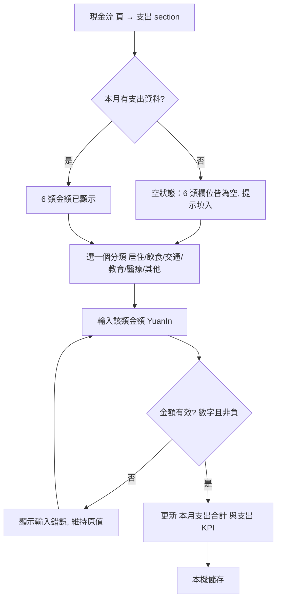
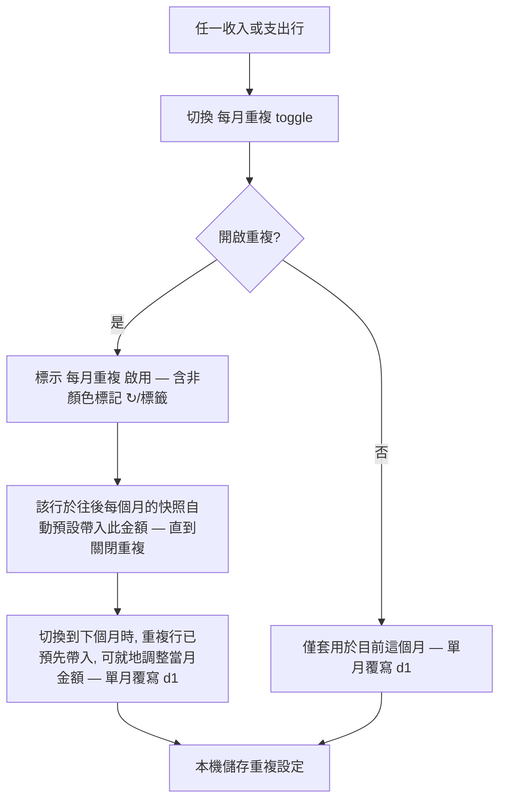
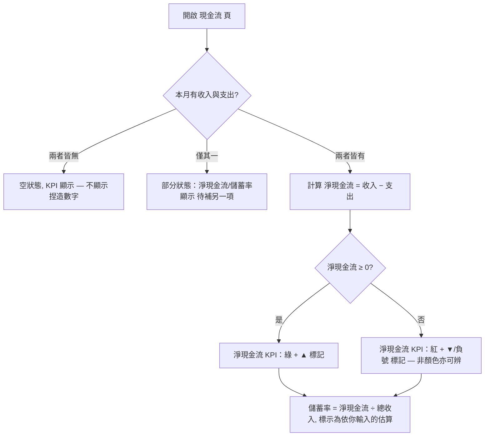
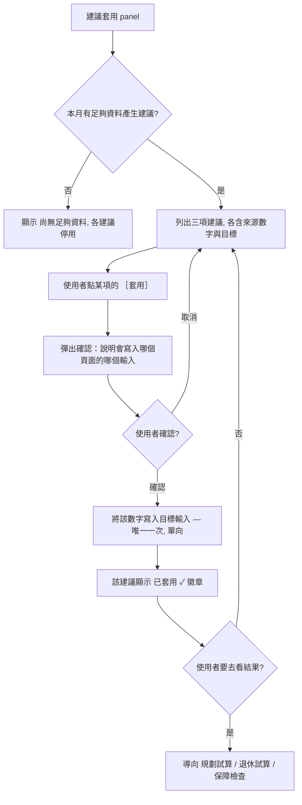
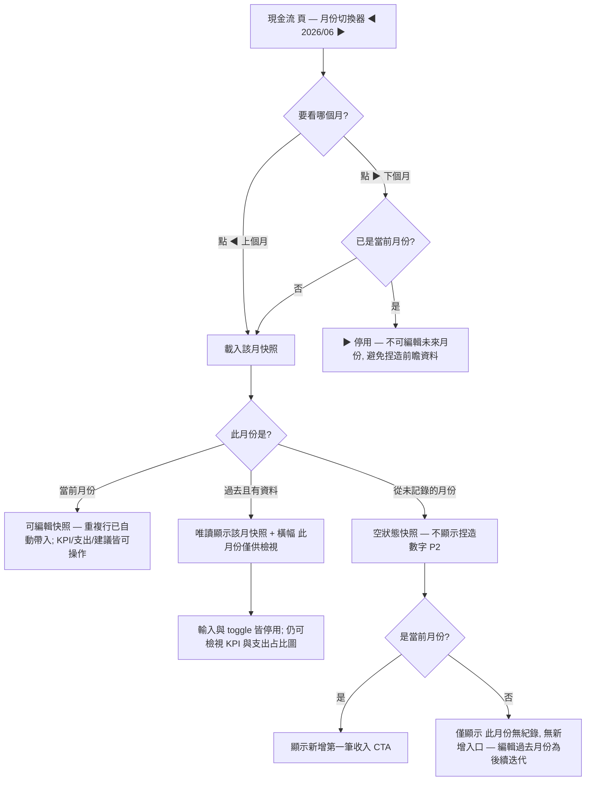

# Cash-Flow Ledger — UX.md

**Slug:** `cash-flow` · **Pillar:** ② 現金流追蹤 · **Phase:** 1 (UX) · **Status:** FINAL — design-gate #1 PASSED (all four Open Questions resolved 2026-06-26); ready for frontend-implementer build. Token roles confirmed with design-system-steward.

> This is the **experience contract** for the 現金流 page. It designs WHAT-the-user-sees and
> HOW-they-move-through-it for the 10 EARS criteria in `PRODUCT.md` (decisions a1/b2/c2/d1/e2/f1).
> It does **not** decide the data model, storage keys, recurring-entry mechanics, the
> active/passive attribution math, or React component shape — those are `TECH.md`'s job.
> Token choices are flagged by **semantic role** (gain/loss/accent/category/warn) for
> `design-system-steward` to confirm; no hex values are picked here (P9).

All screens clone existing `index.app.js` idioms: `page-title` / `page-sub`, the `.kpis`/`.kpi`
(`.lab`/`.val`/`.sub`) cards, `.card` with `h3`+`<small>`, the `.field`+`<label>` grid, `.grid2`/
`.grid32` layouts, `YuanIn`/`NumIn` inputs, the `up`/`down` classes with `▲`/`▼` non-color cues,
the 保障檢查 KPI-cards → field-grids → 建議順序 structure, and the 萬 number convention via
`fmtNum`/`fmtWan`. No new nav pattern, no new card shell.

---

## Information Architecture

### Nav placement (`PAGES`)

The 現金流 page is a new `PAGES` entry. It belongs **after 退休試算 and before 保障檢查**, because
保障檢查 already consumes the 現金流/支出 concept (it guesses `monthlyExpense` today, and the
ledger's living-expense feeds it via SC10c). Putting 現金流 immediately upstream of 保障檢查 keeps
the reading order honest: *record the money flow → check the foundation → plan growth*. It sits
below the two planning pages so the foundation-before-growth order (P6) is preserved — the planner
remains the entry, the ledger and 保障檢查 sit just under it as the foundation layer.

Proposed entry (icon + zh-TW label; final icon is a steward/implementer nicety, not load-bearing):

```
const PAGES = [
  {id:'plan',     icon:'🧮', nm:'規劃試算'},
  {id:'fire',     icon:'🔥', nm:'退休試算'},
  {id:'cashflow', icon:'💸', nm:'現金流'},     // ← NEW (this feature)
  {id:'protect',  icon:'🛡️', nm:'保障檢查'},
  {id:'upload',   icon:'📤', nm:'上傳分析'},
  {id:'curve',    icon:'📉', nm:'資產曲線'},
  {id:'set',      icon:'⚙️', nm:'設定'},
];
```

Icon note: `💸` reads as "money flowing out", which pairs with the income/expense duality; `💰`
or `📊` are acceptable alternates if the steward prefers a non-emoji or a more neutral mark. The
label is fixed at **現金流**; the active month is chosen by the in-page month switcher (below), not
the nav.

### Screen layout (top → bottom, single scroll, data-dense → detail)

The page is a single scrolling view matching the 保障檢查 density (KPIs → cards → 建議順序). Order
top-to-bottom enforces the data hierarchy **KPIs → sections → detail → suggestions**:

1. **`page-title` 現金流** + **month switcher** + **`page-sub`** (one-line explainer). The
   萬-and-`zh-TW` formatting + the estimate framing live here.

   **Month switcher (resolves OQ-1 → switcher).** A compact inline control sits in the page
   header, right-aligned next to / under the `page-title` (top of the page, **before** 保障檢查 in
   nav order — the page position is unchanged). It is a three-part affordance, cloning the existing
   prev/next stepper idiom (no new nav pattern):

   ```
   ◀   2026 / 06   ▶
   prev   current   next
   ```

   - **◀ / ▶** step the active period back / forward one month. They are real buttons with text
     affordances, never color-only (P7): `◀`/`▶` glyphs plus accessible labels (上個月 / 下個月).
   - The **current-month label** (e.g. `2026 / 06`, or `2026 年 6 月` in the `page-sub`) names the
     active period in zh-TW. It is read-only text, not an input.
   - **▶ stops at the current real-world month** — there is no editing of *future* months (a budget
     snapshot for a month that has not begun would be fabricated forward data, P2). `▶` is disabled
     once the active period is the current calendar month.

   **FRAMING — this stays per-month budget *snapshots*, not a transaction ledger.** Consistent with
   PRODUCT decision **d1** ("monthly snapshot, optionally per-month overrides"), each month shows
   *one* income/expense snapshot, never a dated list of individual transactions (that is pillar ④,
   explicitly excluded). The switcher only changes *which month's snapshot* is shown:
   - The **current month** is fully **editable**; recurring lines (c2) auto-populate it.
   - **Past months** show their saved snapshot **read-only** (banner 此月份僅供檢視) — viewing
     history, not editing it. Editing a past month is a noted **fast-follow**, not v1.
   - A month the household never recorded shows the **empty** snapshot (no fabricated numbers, P2),
     not a back-filled guess.

2. **Summary KPI row** — a `.kpis` block of 4 `.kpi` cards, identical structure to 保障檢查:
   - **本月收入** (`.val` = total income 萬; `.sub` = 主動 X ／ 被動 Y split — SC2)
   - **本月支出** (`.val` = total expense 萬; `.sub` = top category or "6 類合計" — SC3)
   - **淨現金流** (`.val` with `up`/`down` + `▲`/`▼` sign cue — SC1, SC9; `.sub` = 收入 − 支出)
   - **儲蓄率** (`.val` = net savings rate %; `.sub` = a **fixed estimate caveat** label — SC4)

   On mobile the row wraps via the existing `repeat(auto-fit,minmax(165px,1fr))` grid used by
   Planner/Fire — no new responsive code.

3. **收入 section** — a `.card` titled **收入（主動／被動）** with a small note. Two labelled
   subtotals (主動收入 / 被動收入) and a line list. Each income line is a `.field`-grid row:
   a label (e.g. 薪資 / 股利租金利息), a `YuanIn` amount, a **mandatory 主動/被動 tag** control
   (segmented toggle), a **每月重複** toggle (recurring — c2), and edit/remove affordances.
   Because a1 fixes income to *salary (主動) + a single 被動 bucket*, the default first-run offers
   exactly those two lines; the tag is required on every line (SC2) and never defaults silently —
   a new line starts with **no tag selected** and is invalid until tagged (see Interaction States).
   *Tokens: the 主動/被動 tags use the **accent** role (主動) and **accent-2/purple** role (被動)
   so the split is legible at a glance — steward to confirm; no hex here.*

4. **支出 section** — a `.card` titled **支出（6 類）** mirroring 保障檢查's field-grid. Six fixed
   category rows (居住 / 飲食 / 交通 / 教育 / 醫療 / 其他 — b2), each a `.field` with a category
   label, a `YuanIn` amount, and a **每月重複** toggle. A **本月支出合計** subtotal closes the
   card. **Category breakdown — Chart.js doughnut (resolves OQ-2 → doughnut).** Below the field
   grid, a **`ChartBox type="doughnut"`** shows the 6-category split, cloning the existing
   Allocation doughnut exactly (`index.app.js:306` 資產類別配置): the shared `pctPlugin` draws the
   slice % labels, a **right-positioned legend** lists each category, and the `cutout:'62%'` +
   `borderColor` match. It is **color-safe (P7)**: every slice and every legend row carries its
   **zh-TW category label + value** (萬), and the tooltip already shows `類別: X 萬（Y%）` — color
   is an at-a-glance aid, never the only cue. Slices use the **`EXPENSE_CAT`** palette already
   registered in `docs/STEERING.md` (居住 blue · 飲食 cyan · 交通 orange · 教育 purple · 醫療
   magenta · 其他 slate) — the **category** token role; no hex picked here (P9). The doughnut
   renders only once at least one category has a value; see Interaction States for its loading /
   empty / populated treatments.

5. **建議套用 panel (suggested feeds — e2/SC10)** — a `.card` titled **建議套用到其他頁面**,
   placed last so it reads as a *derived* action after the data exists, echoing 保障檢查's
   建議順序 card position. It lists the three one-way suggestions, each a row with: the source
   figure, the target page/input, a plain-language sentence, a **［套用］** button, and an
   *accepted* badge once applied. **The accept is always explicit** (P3/SC10) and money-affecting
   accepts get a confirm (see Microcopy). The three rows, in foundation-first order (P6):
   - **① 生活支出 → 保障檢查** (`monthlyExpense`) — foundation first.
   - **② 淨儲蓄 → 規劃試算 每月投入** (`investRate`/monthly-invest basis).
   - **③ 被動收入 → 退休試算 提領抵充** (withdrawal offset).
   *Tokens: 套用 button uses **accent** role; the accepted badge uses **gain/green** + a `✓`
   non-color cue.*

6. The persistent global **disclaimer** (already rendered by `App`) stays below the page — no
   per-page advice copy (P3).

---

## User Flows

All six primary flows for the 家庭財務管理者. Each is a single-page interaction (no route change
except when a suggestion sends the user to another page after accept). Switching the active month
(Flow 6) changes *which month's snapshot* is shown but stays on the page.

### Flow 1 — Record / edit an income line (mandatory 主動/被動 tag — SC2)



### Flow 2 — Record / edit an expense line under a category (SC3, b2)



### Flow 3 — Set a line as recurring (repeats monthly — c2)



> Recurring-line propagation (c2/d1) is what links the per-month snapshots: a line marked 每月重複
> auto-populates the **current** month and every later month's snapshot, so the manager isn't
> re-typing salary/rent each month. A per-month edit on a recurring line is a single-month override
> and does not change other months. Past months show whatever their snapshot held, read-only.

### Flow 4 — Review monthly net + savings rate (SC1, SC4, SC9)



### Flow 5 — Review & ACCEPT a suggested feed (e2/SC10 — explicit, never silent)



> Accept is one-way and explicit per row; the ledger never auto-writes `salary`/`investRate`/
> `withdraw0`/`monthlyExpense` (P3, PRODUCT Scope:Excluded). Re-accepting after the source figure
> changes is allowed and re-confirms.

### Flow 6 — Switch the active month (view past snapshot read-only; current editable — d1, OQ-1)



> The switcher only changes *which month's snapshot* is shown — it is **not** a dated transaction
> ledger (pillar ④, excluded). The current month edits; past months are read-only history
> (此月份僅供檢視). Editing past months is a noted fast-follow, not v1. A never-recorded month shows
> the empty snapshot, never a back-filled or fabricated figure (P2).

---

## Interaction States

"Boil the ocean" — every state for every screen/section. The screen regions are the **Month
switcher**, **Summary KPIs**, **收入 section**, **支出 section** (incl. the breakdown doughnut),
and **建議套用 panel**. The whole-page **empty/first-run** and **loading** states gate them all,
and the month switcher's active-period state (current-editable / past-read-only / no-data) sits
*above* every other region — it decides whether the rest of the page is editable or 唯讀.

### Whole page

| State | Treatment |
|---|---|
| **Loading** | Brief skeleton: KPI cards and section cards render as muted placeholders (use the existing muted/`--muted` role and `--panel2` surface). No spinner-only screen; localStorage read is fast, so this is a one-frame placeholder, not a blocking loader. |
| **Empty / first-run** (SC6, P2) | No KPI numbers fabricated. KPI `.val`s show a neutral `—` (em-dash), **never** a `salary×0.6`-style guess. A prominent first-run explainer card sits at top: what the page is, that data stays on-device, and a single CTA **［新增第一筆收入］**. The 收入/支出 sections show their empty variants (below). The 建議套用 panel shows the no-suggestion variant. |
| **Populated** | KPIs computed from entries; sections list real lines; suggestions available. |
| **Error — storage write failed** | If a localStorage write throws (quota/private-mode), show a non-blocking inline notice: "無法在本機儲存，請確認瀏覽器允許本機儲存空間。" Data stays in the in-session view; no silent loss. |

### Month switcher (active-period control — OQ-1)

This control gates whether the rest of the page is editable. It is always visible in the header.

| State | Treatment |
|---|---|
| **Current month (editable)** | Default on open: the active period is the current calendar month. Label shows e.g. `2026 / 06`; `◀` enabled, **`▶` disabled** (no future months — a future budget snapshot would be fabricated forward data, P2). The KPIs / 收入 / 支出 / 建議 regions are all live and editable; recurring lines auto-populate this month. |
| **Past month (read-only)** | After `◀` into an earlier month that has a saved snapshot: the page shows that month's snapshot with a top **read-only banner** "此月份僅供檢視" (with a `🔒`/non-color word cue, not color alone). `◀`/`▶` stay enabled to keep navigating. All inputs, tag toggles, 每月重複 toggles, and 建議 ［套用］ buttons are **disabled** (history, not editing). KPIs and the 支出 doughnut still **render** (viewing a past month's numbers is the point). Editing past months is a flagged fast-follow. |
| **Month with no data (empty snapshot)** | A month the household never recorded: the regions show their **empty** variants — KPIs `—`, 收入/支出 empty, no doughnut — **no fabricated or back-filled numbers** (P2). If this month is the *current* month, the first-run CTA ［新增第一筆收入］ shows; if it is a *past* never-recorded month, show only "此月份無紀錄" with **no add affordance** (can't back-fill a past month in v1). |
| **Switching / loading** | On `◀`/`▶`, the snapshot read is a localStorage lookup (fast) — render a one-frame muted placeholder for the regions, not a blocking spinner, matching the whole-page Loading treatment. The switcher label updates immediately so the user sees which month they moved to. |
| **Boundary — `▶` at current month** | `▶` is disabled (muted, with a tooltip/aria "已是最新月份") rather than stepping into an editable future month. `◀` has no hard lower bound, but a never-recorded earlier month falls through to the empty-snapshot state above. |
| **Disabled (whole switcher)** | The switcher itself is never globally disabled in v1 — even during a storage-error, the user can still navigate months to view in-session data. |

### Summary KPI row

| State | Treatment |
|---|---|
| **Loading** | 4 muted placeholder cards. |
| **Empty** | All four `.val` = `—`; `.sub` = brief hint (e.g. 淨現金流 `.sub` = "先記錄收入與支出").儲蓄率 card always carries the estimate caveat even when empty. |
| **Partial — income only** | 本月收入 populated; 本月支出 = `—` with `.sub` "尚未記錄支出"; 淨現金流 = `—` ("待補支出"); 儲蓄率 = `—`. No negative/positive is asserted until both sides exist. |
| **Partial — expense only** | Mirror: 本月支出 populated; 本月收入 = `—` ("尚未記錄收入"); 淨現金流/儲蓄率 = `—` ("待補收入"). |
| **Populated — net ≥ 0** | 淨現金流 `.val` uses **gain** role + `▲` and a `+` sign; 儲蓄率 shows %, `.sub` = estimate caveat. |
| **Populated — net < 0 (negative-net-flow)** (SC9, P7) | 淨現金流 `.val` uses **loss** role + `▼` **and** a leading `−` sign **and** a text label "本月入不敷出" in `.sub` — three cues (color + arrow/sign + words), so it reads without color. 儲蓄率 shows a negative % with the same `▼`/`−` treatment. This clones the Dashboard `up`/`down`+`▲`/`▼` pattern exactly. |
| **Recalculating** | When an entry changes, KPIs update live (no spinner); same as Planner's reactive `useMemo` feel. |

### 收入 section (主動／被動)

| State | Treatment |
|---|---|
| **Loading** | Muted card placeholder. |
| **Empty / first-run** | Card shows the explainer + an enabled **［＋新增收入］**; 主動/被動 subtotals show `—`. No sample amounts. |
| **Partial** | Some lines present, subtotals reflect them; the "add another" affordance stays available. |
| **Populated** | Lines list with 主動/被動 subtotals; each line shows amount + tag + 每月重複 status. |
| **Editing a line** | Inline edit: `YuanIn` active, tag toggle active, Save/Cancel. Other lines stay read-only. |
| **New line — no tag yet (invalid)** (SC2) | A freshly-added line has **no 主動/被動 selected**; Save is **disabled** and an inline hint "請選擇 主動或被動" shows. The tag is mandatory; there is no silent default. |
| **Recurring-active** | Line carries a **每月重複** badge with a `↻` glyph + the word "每月" (non-color cue), echoing how it will pre-fill future months (c2/d1). |
| **Invalid input — non-numeric / negative** | `YuanIn` already coerces to a number; a negative income value is disallowed → inline error "金額需為 0 或正數" and Save disabled. Non-numeric is coerced to 0 with a soft hint, matching existing input behavior. |
| **Disabled (read-only past month)** | When the month switcher is on a **past month**, the whole 收入 section is read-only: `YuanIn` inputs, tag toggles, 每月重複 toggles, and add/remove affordances render disabled, under the page-level 此月份僅供檢視 banner. Subtotals still display that month's recorded values. |
| **Error** | Storage-write failure surfaces the whole-page storage notice; the entered value remains visible. |

### 支出 section (6 類)

| State | Treatment |
|---|---|
| **Loading** | Muted card placeholder. |
| **Empty / first-run** | All six category fields render empty (placeholder `0`) with a one-line prompt "填入本月各類支出"; 本月支出合計 = `—`. No fabricated category amounts (P2). |
| **Partial** | Some categories filled, others empty; 合計 reflects only filled categories. |
| **Populated** | Six categories with amounts; 合計 shown; the breakdown **doughnut** renders below the grid (states detailed in the next sub-table). |
| **Editing** | Same `YuanIn` inline editing as 保障檢查's expense fields; no modal. |
| **Recurring-active** | Per-category 每月重複 toggle with the `↻`/"每月" badge when on (e.g. 居住 rent repeats). |
| **Invalid input — negative / non-numeric** | Negative disallowed → "金額需為 0 或正數", value not committed; non-numeric coerced to 0 per existing `YuanIn`. |
| **Disabled (read-only past month)** | On a past month, the six fields and 每月重複 toggles render disabled under the 此月份僅供檢視 banner; 合計 and the doughnut still show that month's recorded values. |
| **Error** | Whole-page storage notice; entered value retained in-session. |

#### 支出 breakdown doughnut (resolves OQ-2 — `ChartBox type="doughnut"`)

Clones the Allocation doughnut (`index.app.js:306`): shared `pctPlugin` slice-% labels +
right-positioned legend + `EXPENSE_CAT` palette. **Color-safe (P7): every slice and every legend
row carries its zh-TW category label + value; color is an aid, never the only cue.**

| State | Treatment |
|---|---|
| **Loading** | Muted placeholder block where the chart will render (matches the whole-page one-frame placeholder); no spinner. |
| **Empty (no category has a value)** | The doughnut is **not** rendered — drawing an all-zero ring would fabricate a shape (P2). Instead a muted line "填入支出後顯示各類占比圖" sits in its place. (`pctPlugin`/`ChartBox` also early-return on a zero total, so this is belt-and-braces.) |
| **Partial (some categories filled)** | Doughnut renders with only the filled categories as slices; the legend lists exactly the categories present, each with its 萬 value + %; absent categories don't appear (no zero-slivers). |
| **Populated (all/most filled)** | Full 6-slice doughnut; `pctPlugin` prints each slice's rounded % on the arc; tooltip shows `居住: X 萬（Y%）` etc. Each slice uses its `EXPENSE_CAT` hue (居住 blue · 飲食 cyan · 交通 orange · 教育 purple · 醫療 magenta · 其他 slate). |
| **Legend** | Right-positioned legend (the existing `legend:{position:'right'}` idiom). Each row = the **zh-TW category label** + its color swatch; the label is always present so the chart reads without color (P7). On narrow/mobile widths the legend wraps under the ring per the existing chart layout — no new responsive code. |
| **Read-only past month** | The doughnut still renders that month's recorded split (viewing is the point); it carries no interactive controls, so the read-only banner doesn't change its appearance. |
| **Single category only** | If exactly one category has a value, the doughnut is a full ring of that one hue; the legend + tooltip still name it and show 100% — labelled, not color-only. |

### 建議套用 panel (suggested feeds — e2/SC10)

| State | Treatment |
|---|---|
| **Loading** | Muted card placeholder. |
| **No-suggestion** | When there's not enough data for a given feed (e.g. no expense yet → no 生活支出 suggestion), that row shows "尚無足夠資料可建議" and its **［套用］** is **disabled**. Each of the three rows resolves independently. |
| **Suggestion-available** | Row shows the source figure (萬), the target ("→ 規劃試算 每月投入" etc.), a plain sentence, and an enabled **［套用］**. |
| **Confirming** | On click, a confirm dialog states exactly which page + input will be written and the value, e.g. "將淨儲蓄 X 萬套用到規劃試算的每月投入？" with ［套用］/［取消］. Money-affecting → always confirmed (P3/SC). |
| **Accepted** | Row shows a **已套用 ✓** badge (gain role + `✓` non-color cue) and the applied value/time; **［套用］** becomes **［重新套用］** (re-confirms) so a later source change can be re-pushed. The accept never happened silently. |
| **Accept failed** | If writing the target input fails (e.g. target storage error), show "套用失敗，請再試一次" and leave the badge un-set; no partial write asserted. |
| **Disabled (no target relevance)** | If a target page's input doesn't exist yet for some reason, the row degrades to disabled with a muted explanation rather than erroring. |

> **Negative-net-flow** is the single most important non-color treatment and recurs in both the
> 淨現金流 KPI and 儲蓄率 KPI: **color (loss role) + arrow (`▼`) + sign (`−`) + word ("入不敷出")**.
> This matches `index.app.js:116` (`mDelta>=0?'▲':'▼'`) and the `up`/`down` classes — P7/SC9.

---

## Microcopy (zh-TW · 台灣)

All Traditional Chinese; 萬 convention and `zh-TW` number formatting throughout (P8/SC8). Tone:
reassuring + precise; estimates labelled as estimates (P3); money-moving accepts confirmed.

### Nav + page header
- **Nav label:** 現金流
- **Page title:** 現金流
- **Page sub:** 記錄每月家庭收入與支出，算出真實的淨現金流與儲蓄率。資料只存在本機，不會上傳。

### Month switcher + read-only past month (OQ-1)
- 月份標籤格式：{YYYY} 年 {M} 月（如 2026 年 6 月）；切換器精簡顯示 {YYYY} / {MM}
- 上一月按鈕（aria/title）：上個月
- 下一月按鈕（aria/title）：下個月
- ▶ 已達當前月份（停用 tooltip）：已是最新月份
- 過去月份唯讀橫幅：此月份僅供檢視（過去月份的紀錄無法修改）
- 從未記錄的過去月份：此月份無紀錄
- 切換說明（small，選用）：切換月份只會檢視該月的收支快照，不是逐筆交易紀錄。

### KPI labels (SC1/SC2/SC3/SC4)
- **本月收入** · `.sub`：主動 {X} 萬／被動 {Y} 萬
- **本月支出** · `.sub`：6 類合計
- **淨現金流** · `.sub`：收入 − 支出（正值為結餘）
- **儲蓄率** · `.sub`：依你輸入的收支估算，僅供參考
- 負淨現金流 `.sub`：本月入不敷出（支出大於收入）
- KPI label note：當切換到過去月份時，KPI 標籤的「本月」改讀作所選月份（如「{YYYY} 年 {M} 月收入」），以免唯讀檢視時誤稱當前月。負值文案改為「該月入不敷出」。

### 收入 section
- **Section heading:** 收入（主動／被動）
- 子標：主動收入 / 被動收入
- 標籤控制：主動 ｜ 被動（必選）
- 新增按鈕：＋ 新增收入
- 被動收入說明（small）：股利、租金、利息等不需持續工作的收入

### 支出 section
- **Section heading:** 支出（6 類）
- **6 類名稱:** 居住 ／ 飲食 ／ 交通 ／ 教育 ／ 醫療 ／ 其他
- 合計：本月支出合計 {Z} 萬

### Recurring toggle (c2)
- Toggle label：每月重複
- On 狀態徽章：↻ 每月（會自動帶入往後月份）
- Off 說明：僅套用於本月

### Empty / first-run (SC6/P2)
- First-run 標題：開始記錄你的現金流
- First-run 內文：這頁幫你記錄每個月的家庭收入與支出，算出真實的淨現金流與儲蓄率，取代用猜的投入比例。資料只存在你的瀏覽器，不會上傳到任何地方。
- First-run CTA：＋ 新增第一筆收入
- 收入空狀態：尚未記錄本月收入
- 支出空狀態：填入本月各類支出
- KPI 空值佔位：—（不顯示捏造或範例數字）

### Error messages
- 金額驗證：金額需為 0 或正數
- 未選標籤：請選擇 主動或被動
- 本機儲存失敗：無法在本機儲存，請確認瀏覽器允許本機儲存空間。
- 套用失敗：套用失敗，請再試一次

### Suggested-feed panel (e2/SC10)
- **Section heading:** 建議套用到其他頁面
- Section sub（small）：以下為單向建議，需你確認後才會寫入，不會自動覆蓋你的設定。
- 套用按鈕：套用
- 已套用徽章：已套用 ✓
- 重新套用：重新套用
- 無資料：尚無足夠資料可建議

**Confirm copy (money-affecting — always confirmed):**
- 生活支出 → 保障檢查：將本月生活支出 {X} 萬套用為「保障檢查」的每月生活支出？
- 淨儲蓄 → 規劃試算：將淨儲蓄套用到規劃試算的每月投入？（會以你記錄的淨儲蓄取代目前的投入估算）
- 被動收入 → 退休試算：將被動收入 {Y} 萬套用為退休試算的提領抵充？
- 確認 / 取消按鈕：套用 ／ 取消
- 套用成功提示：已套用，可到該頁面查看更新後的試算。

> **Naming flag for TECH / calc-test-auditor (OQ-3 resolved).** The Planner-feed figure is
> **computed from 淨現金流 (收入 − 支出)** but is **labelled 淨儲蓄** in all user-facing copy (the
> household reads it as "what I can invest"). v1 has no save-vs-invest split, so the two are the
> same number; TECH must **name the derived figure consistently** (one source-of-truth derivation),
> and the calc-test-auditor should assert that the value fed to the Planner monthly-invest basis
> equals 淨現金流 for the active month.

---

## Decisions (resolved 2026-06-26)

Design-gate #1 **PASSED** — all four parked questions are decided; **no Open Questions remain.**

- **OQ-1 → month switcher.** v1 ships an in-header month switcher (`◀ 2026 / 06 ▶`) above 保障檢查
  in nav order. Stays **per-month budget snapshots** (PRODUCT d1) — **not** a dated transaction
  ledger (pillar ④, excluded). Current month editable; recurring lines auto-populate each month;
  past months are read-only (此月份僅供檢視). Editing past months is a noted fast-follow. `▶` stops
  at the current real-world month (no fabricated future data, P2).
- **OQ-2 → Chart.js doughnut.** The 支出 6-category breakdown uses `ChartBox type="doughnut"`,
  cloning the Allocation doughnut (`index.app.js:306`) + the shared `pctPlugin` + a right-positioned
  legend. Color-safe (P7): every slice/legend row carries its zh-TW category label + 萬 value, never
  color-only. Uses the `EXPENSE_CAT` palette in `docs/STEERING.md`. (Replaces the earlier mini-bar
  recommendation.)
- **OQ-3 → 淨現金流, labelled 淨儲蓄.** The Planner-feed figure is **computed from 淨現金流** but
  **labelled 淨儲蓄** in copy. Naming flagged above for TECH to derive consistently and for the
  calc-test-auditor to assert.
- **OQ-4 → magenta (醫療).** 醫療 stays magenta `#e879f9` (`EXPENSE_CAT`); the steward's
  STEERING/DESIGN mapping stands — no change.

## Open Questions

None remaining — all four resolved above (see `## Decisions`).

---

*Drafted + finalized by `ux-flow-designer` (Phase 1). **Design-gate #1 PASSED** — OQ-1/2/3/4
folded (see `## Decisions`, 2026-06-26). Experience contract only — no data model, no component
code, no storage/state decisions (the month-snapshot persistence shape, the doughnut's data wiring,
and the 淨儲蓄 derivation are `TECH.md`'s job; this spec only specifies the experience + flags the
naming). Token roles (incl. `EXPENSE_CAT`; 醫療 = magenta `#e879f9`) confirmed with `design-system-steward`;
no hex picked here (P9). All interaction states enumerated.*
